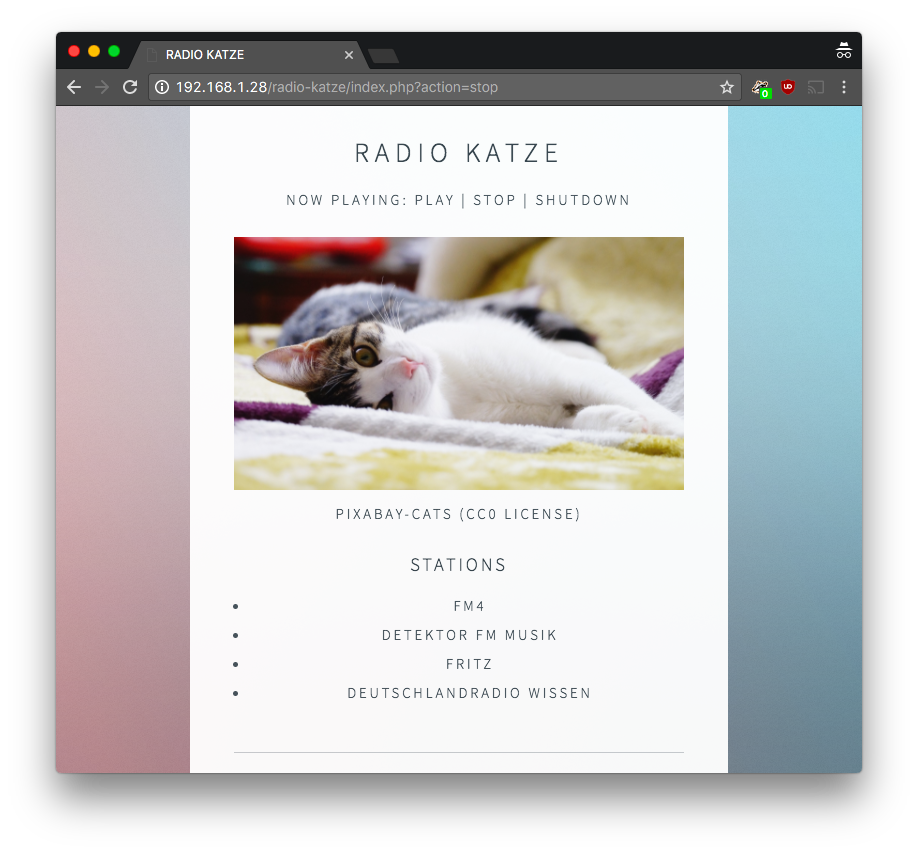

# radio-katze
internet radioplayer script for music player daemon (tested with raspberrypi v2), powered by php and can be used via html5 webinterface

Disclaimer: Quick & dirty php script, very (very) simple approach. ;-)

## usage

1. set up raspberrypi with raspian and install mpd (https://www.musicpd.org/)
2. set up apache webserver
3. clone/copy the files in new directory in var/www/html/ (e.g. "radio-katze")
4. install composer (https://getcomposer.org/doc/00-intro.md)
5. run „composer install“ in new directory
6. visit http://IP-OF-YOUR-RASPBERRYPI/radio-katze/
7. enjoy!

Right now adding stations is only possible in the source code (see array stations)

## license

* This simple script is free for any use under MIT license
* MPD control via SimpleMPDWrapper by mutantlabs (https://github.com/mutantlabs/SimpleMPDWrapper), MIT license
* HTML5Up theme under CC BY 3.0 Unported http://creativecommons.org/licenses/by/3.0/, https://html5up.net/
* Cat pics from Pixabay.com under CC0 Public domain license - thanks to all cats and photographers! <3
  * https://pixabay.com/de/cat-tiere-haustier-rest-haustiere-56753/
  * https://pixabay.com/de/ausschreibung-niedliche-tier-2119828/
  * https://pixabay.com/de/fotomanipulation-cat-photoshop-1078993/
  * https://pixabay.com/de/k%C3%A4tzchen-katze-flauschige-katze-227009/
  * https://pixabay.com/de/katze-nacht-rodeur-nacht-fiel-2194707/
  * https://pixabay.com/de/cat-ruhig-schlafen-nicken-faulheit-2088903/
  * https://pixabay.com/de/cat-traum-katze-mit-traum-2119814/
  * https://pixabay.com/de/cat-katzenartige-haustiere-tier-2065300/
  * https://pixabay.com/de/cat-freund-tier-haustiere-636172/
  * https://pixabay.com/de/cat-haustier-tier-aussehen-1728596/
  * To add more: just copy image in pixabay-cats/ folder

Feel free to fork, share & critize :-)

Big thanks to all people who provide help and tutorials on the web!

## alternatives

There are some alternatives for music server / music player:
* https://github.com/ArturSierzant/OMPD
* https://github.com/mopidy
* ... 

